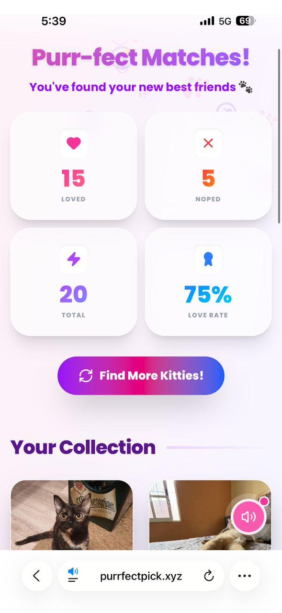
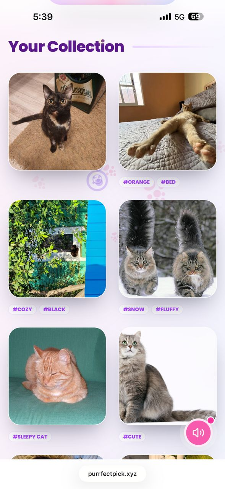
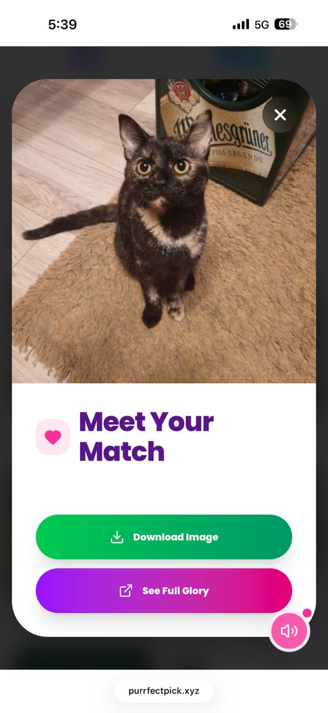

# 🐱 Paws & Preferences: The Ultimate Cat Discovery Experience

Website URL: https://www.purrfectpick.xyz/

Paws & Preferences is a premium, interactive web application designed for cat lovers to discover, filter, and collection their favorite feline friends. Built with a focus on immersive UI/UX, the app combines high-quality animations with powerful image manipulation tools.

## 🚀 Tech Stack & Implementation

The application is built using a modern, performant stack to ensure a seamless "app-like" experience in the browser:

- **Framework**: [Next.js](https://nextjs.org/) (App Router) for a robust, React-based foundation.
- **Language**: [TypeScript](https://www.typescriptlang.org/) for type-safe development and reliable API integrations.
- **Styling**: [Tailwind CSS](https://tailwindcss.com/) for a sleek, responsive design system.
- **Animations**: [Framer Motion](https://www.framer.com/motion/) powering the core interaction engine (swiping, gestures, and transitions).
- **Icons**: [Lucide React](https://lucide.dev/) for elegant, consistent iconography.
- **API**: [Cataas](https://cataas.com/) (Cat as a Service) for fetching dynamic cat data and server-side image processing.

---

## ✨ UI/UX Design & Animations

### 💎 Design Philosophy: "Discovery Dashboard"
We've adopted a **Glassmorphism** aesthetic, utilizing deep backdrop blurs, semi-transparent white containers, and vibrant gradient accents. This creates a premium, state-of-the-art feel that keeps the focus on the beautiful cat photography.

### 🎭 Animation Engine
- **Gesture-Driven Interfaces**: The main cat stack uses physics-based swiping. We use Framer Motion's `useMotionValue` and `useTransform` to map dragging gestures to rotation and opacity changes.
- **Responsive Scaling**: The UI isn't just fluid; it's smart. On larger screens, the design scales up its components (fonts, buttons, containers) to maintain usability and visual impact without losing the "perfect mobile" feel.
- **Micro-interactions**: Every button and slider reacts to your touch with subtle scales and color shifts, making the interface feel alive and responsive.

---

## 🛠️ Key Functionalities

### 1. Immserive Discovery (Swiping)
The heart of the experience is the Tinder-style discovery stack. Users can swipe left to "Nope" a kitty or right to "Like". The stack handles rapid interaction with pop-layout animations.

### 2. Advanced Cat Customizer (Filters)
The discovery experience is fully customizable. Through the "Cat Customizer" modal, users can apply:
- **Color Filtering (RGB)**: Influence the red, green, and blue channels of the image.
- **Style Adjustments (HSL)**: Fine-tune Brightness, Saturation, Hue, and Lightness.
- **Photo Effects**: Apply "Mono", "Blur", or "Negate" presets.
- **Dimensions & Text**: Request specific image sizes or add custom captions.
- **Tags**: Filter by personality (e.g., #cute, #funny, #orange).

### 3. Session Statistics
At the end of each session, the app compiles a comprehensive dashboard. It tracks your "Love Rate" (percentage of likes) and breaks down your activity across the session.

### 4. Personal Collection
All your "Liked" cats are automatically saved into a beautiful grid collection. Each cat is presented with its unique ID and tags.

### 5. Detailed View & Download
Clicking on any cat in your collection opens a full-screen, high-definition view. From here, you can see the kitty in all its glory and download the image directly to your device.

### 🎵 Ambience: The Music Player
To create the perfect discovery vibe, we've included a floating Music Player. Featuring smooth volume transitions and a play/pause toggle, it provides a curated lo-fi soundtrack that fits the "discovery" aesthetic perfectly. For a focused experience, the player intelligently hides itself when you're deep in the customization menus.

---

## 🛠️ Getting Started

1. Clone the repository
2. Install dependencies: `npm install`
3. Run the development server: `npm run dev`
4. Open [http://localhost:3000](http://localhost:3000) in your browser.

Developed with ❤️ (and 🐈) by the Paws & Preferences Team.
